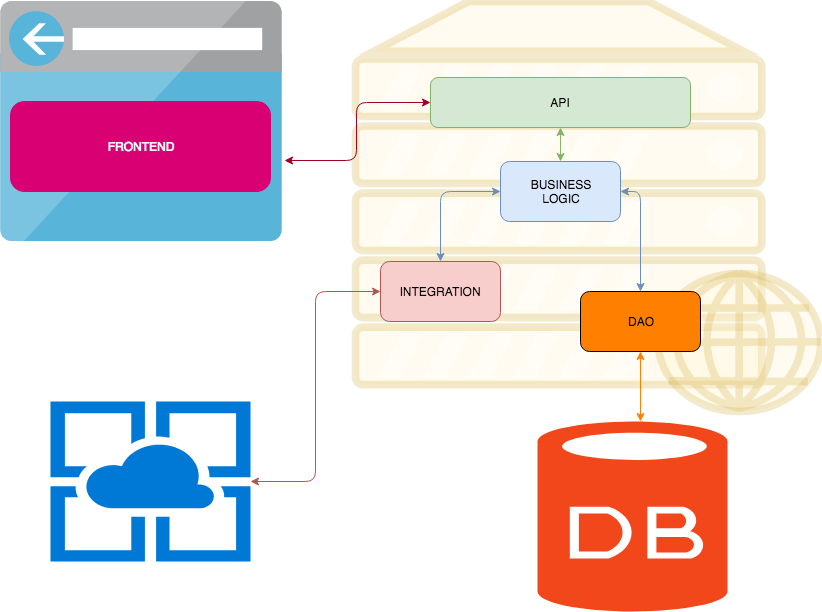

A "Kiss architecture": Springboot + Angular
============================================
[](https://travis-ci.org/paspao/springboot-kiss-architecture)


Like suggested by wikipedia, KISS is an acronym for "Keep it simple, stupid" as a design principle noted by the U.S. Navy in 1960. The KISS principle states that most systems work best if they are kept simple rather than made complicated; therefore simplicity should be a key goal in design, and that unnecessary complexity should be avoided. The phrase has been associated with aircraft engineer Kelly Johnson.

Nell'arco delle mie esperienze di sviluppo ho avuto modo di sperimentare vari tipi di tecnologie, avendo la possibilità di vedere lo sviluppo di un applicativo sia dal punto di vista client (che possa essere una SPA o un App nativa) sia dal punto di vista server. Accumulando queste esperienze ho provato a sviluppare un'architettura semplice che prevede il rispetto di *PATTERN* fondamentali in un contesto *CRUD*, proverò ad illustrare le fondamenta di questa architettura, utilizzata come punto di partenza in tutti i progetti realizzati da me.

Nella progettazione di questa architettura ho cercato di tenere a mente sempre il concetto KISS, e proprio in quest'ottica ho previsto 5 strati anche detti tier, ognuno con delle logiche specifiche di utilizzo, ovvero:

* FRONTEND
* API
* BUSINESS LOGIC
* INTEGRATION
* DAO

Quindi utilizzo un modello architetturale *multi-tier*, l'ordine utilizzato nell'elenco è lo stesso seguito dal flusso di informazioni, partono dal frontend per arrivare fino ai DAO. 



L'articolo fa riferimento al progetto scaricabile al link [https://github.com/paspao/springboot-kiss-architecture](https://github.com/paspao/springboot-kiss-architecture)

```bash
git clone https://github.com/paspao/springboot-kiss-architecture
```

E' un progetto organizzato utilizzando una struttura **maven** di tipo padre figlio, lo stesso frontend, sviluppato in Angular, viene inserito nella fase di building **maven** per poter creare un unico artefatto, nel paragrafo *FRONTEND* viene spiegato come.

Entrando nei dettagli di ogni tier preferisco utilizzare un approccio di tipo *BottomUp*, partiamo dunque dai dati.

## DAO

Quando parliamo di applicativi CRUD per prima cosa parliamo di dati, in mondi SQL, NOSQL ma comunque dati da collezionare e trattare. Questo modulo nel mio disegno rappresenta il punto più profondo se lo guardiamo come uno stack di tier, quello che ha a che fare con i dati nel quale ricade la descrizione delle entità e la logica di accesso. Attenzione, semplice logica di accesso ai dati: inserimento, modifica, cancellazione e visualizzazione nulla di più e nulla che la leghi ad altri tier; è il tier più profondo ed anche uno di quelli che non ha dipendenze con nessun altro dei suoi fratelli. Non gestisce aspetti specifici dell'applicativo, come autorizzazioni, transazioni o altro: solo ed esclusivamente accesso ai dati.
In un contesto Springboot utilizziamo tecnologie quali **Entity** e **Repository**, nel dettaglio mostro la **@Configuration** del modulo DAO, *annotation* centrale in ogni applicativo/modulo Springboot.

```java
@Configuration
@ComponentScan("org.ska.dao")
@EntityScan(basePackages = {"org.ska.dao.entity"})
@EnableJpaRepositories(basePackages = {"org.ska.dao.repository"})
@EnableAutoConfiguration
@EnableTransactionManagement
public class KissDaoConfiguration {
}
```
Quindi definisco dove si trovano i *Component* specificando dove si trovano le Entity ed i Repository. In più abilito le transazioni, così facendo chiunque utilizzerà il modulo DAO non dovrà preoccuparsi di aspetti relativi alla configurazione del DAO.


## INTEGRATION

Di solito la semplice gestione CRUD dei dati non basta, probabilmente avremmo bisogno di colloquiare con altri sistemi che prescindono dai nostri dati, come servizi di tipo JAX-WS o JAX-RS, oppure sistemi di stampa specifici, con protocolli diversi. In questa componente ricadono tutte le interazioni che prescindono dalla lagica dell'applicativo e che hanno un'altissima possibilità di riutilizzo. 

Come per il DAO anche questo componente è di tipo foglia, non colloquierà direttamente con nessun altro strato dell'architettura piuttosto verrà utilizzato, così facendo DAO ed INTEGRATION garantiranno un'alta riusabilità.

```java
@Configuration
@ComponentScan(basePackages = {"org.ska.integration.beans"})
public class KissIntegrationConfiguration {

    @Bean
    public GeoApiContext geocoder(){
        GeoApiContext context = new GeoApiContext.Builder()
                .apiKey("Your apikey")
                .build();
        return context;
    }
}
```

Qui riporto il punto centrale della configurazione del modulo, in cui c'è solo un riferimento a dove sono definiti i **Service** e la creazione di un servizio *third party*.

## BUSINESS LOGIC

Ogni applicativo, dopo l'identificazione dei dati da trattare, deve occuparsi della gestione della logica di interazione tra questi, coniugare i requisiti utente in logica applicativa, spezzentandoli, per poi offrire ai tiers superiori  strumenti dall'utilizzo semplice ed efficace che permettano elaborazioni senza entrare nei dettagli di come è strutturata la banca dati o di quale tipologia di integrazione vi sia sotto. 

In questo tier inoltre troviamo la definizione e l'utilizzo dei **DTO** (Data Transfer Object) che permettono di mascherare i dati che effettivamente sono sulla banca dati o nei vari bean di integrazione: ma perchè? 
Le ragioni sono diverse è, innanzitutto, una forma di protezione dei dati sensibili (ad esempio dati utente come una password oppure timestamp o informazioni di altra natura necessarie alla coerenza dei dati, ma non all'utente finale). In altre situazioni invece il dato restituito è un dato elaborato, che probabilmente attingerà da più fonti, quindi è necessario strutturare e rendere coerenti questi dati. 
C'è poi da sottolineare un altro aspetto, la serializzazione dei dati: in alcuni contesti è necessario trasformare le informazioni presenti in banca dati, per renderle fruibili all'uomo, questo ad esempio obbliga gli sviluppatori a "macchiare" con delle logiche di serializzazione le *Entità*, il cui scopo dovrebbe essere  solo quello di rappresentare i dati, non serializzarli, un esempio: il campo DATE sul db magari è un numero, ma all'utente dobbiamo presentare una data leggibile, per farlo utilizziamo delle annotazioni per la formattazione probabilmente, che può essere una soluzione, ma così facendo leghiamo aspetti di serializzazione ad un entità, sul lungo termine questo tipo di soluzione porta all'inusabilità in termini di riutilizzo e illegibilità, Harold Abelson disse *Programs must be written for people to read, and only incidentally for machines to execute*.

I DTO permettono di fronteggiare i problemi elencati, creando una sorta di "cuscinetto", di conseguenza più *loosely coupled* e maggiore riusabilità.

Ricapitolando la BUSINESS LOGIC comunica con il tier DAO e il tier INTEGRATION, creando sinergia ed interazione tra i due, in più aggiunge logica e trasformazione dei dati in DTO fruibili da altri tier. Attenzione il livello di business logic utilizza DTO definiti al suo interno e lo stesso vale per i dati  resituiti, non sono MAI oggetti definiti in altri tier, questo per garantire quanto detto in precedenza ed avere sempre la possibilità di agire su quanto restituito.

Un'altra caratteristica di questo tier è la gestione del transazioni: implementando logica di business è in grado di stabilire se un'operazione sui dati possa andare a buon fine o meno, di conseguenza definire la transazionalità dell'operazione.

Di seguito riporto la **@Configuration** del tier business logic:

```java
@Configuration
@ComponentScan(basePackages = {"org.ska.business"})
@Import({KissDaoConfiguration.class, KissIntegrationConfiguration.class})
public class KissBusinessConfiguration {
	
	@Bean
    public Mapper dozerMapper(){
        Mapper dozerBeanMapper =  DozerBeanMapperBuilder.buildDefault();
	    return dozerBeanMapper;
    }

}
```

E' l'unico modulo ad avere un legame diretto con DAO ed INTEGRATION, quindi necessariamente dovrà importare le configurazioni per poterli utilizzare. Inoltre per velocizzare il mapping tra Entity e DTO è una buona norma avvalersi di framework nati per questo, evitando blocchi di codice lunghi e poco leggibili di *setter* e *getter*; nel caso specifico, utilizzo un framework di mapping **Dozer**.

## API

In questo tier ricade la logica di presentation, rappresenta il punto di ingresso del nostro applicativo, almeno dal punto vista server, in esso sono definiti i servizi che siano essi di tipo JAX-RS o JAX-WS che hanno principalmente il compito di presentare i dati in XML, JSON o altro. La sua unica forma di comunicazione è verso il tier della BUSINESS LOGIC: un servizio non farà altro che chiamare uno o piu servizi offerti dal layer di Business, non utilizzerà mai il tier di INTEGRATION o DAO, nè tantomeno utilizzerà oggetti definiti al loro interno, questo sempre nell'ottica di evitare *tightly coupled* e *spaghetti code*. 

Si occupa della gestione di aspetti di autenticazione ed autorizzazione, qui infatti è possibile stabilire chi può eseguire o meno un'operazione: nei layer sottostanti è molto più complicato o meglio l'informazione necessaria  per stabilire quale ruolo sia necessario non è ancora nota. 

Le API vanno in qualche modo documentate, SEMPRE: uno dei difetti del mondo REST è proprio l'assenza di un descrittore universale di questi servizi. Una tecnologia che garantisce questo aspetto è **Swagger**, oggi diventata OpenAPI: permette di documentare le API, ma la documentazione prodotta può essere riutilizzata anche per generare la parte client, quindi non solo puramente descrittiva. Ad esempio nel nostro caso il layer di comunicazione con i servizi REST è stato completamente generato dalla descrizione Swagger dei servizi: nel modulo **FRONTEND** è presente la cartella *remote-services* che contiene il risultato di questa generazione ad opera del tool [https://editor.swagger.io](https://editor.swagger.io).

Nella **@Configuration** del tier di api, importo la configurazione del tier di business e configuro la generazione della documentazione Swagger.

```java
@Configuration
@Import(KissBusinessConfiguration.class)
@EnableSwagger2
public class KissApiConfiguration {
	
	    @Autowired
	    private Environment env;

	    @Bean
	    public Docket api() {
	        return new Docket(DocumentationType.SWAGGER_2)
	                .select()
	                .apis(RequestHandlerSelectors.basePackage("org.ska.api.web"))
	                .paths(PathSelectors.any())
	                .build()
	                .apiInfo(apiInfo());
	    }

	    private ApiInfo apiInfo() {
	        return new ApiInfo(
	                "Contact management REST API",
	                "API",
	                env.getProperty("info.version"),
	                null,
	                new Contact("Pasquale Paola", "https://www.linkedin.com/in/pasqualepaola/", "pasquale.paola@gmail.com"),
	                null, null, Collections.emptyList());
	    }
	    
}
```

## FRONTEND

Rappresenta la Single Page Application: questo tipo di applicazione deve essere completamente scissa dall'applicativo e l'utilizzo della tencologia Rest già garantisce questo aspetto ma è necessario prestare attenzione a come viene implementata la comunicazione con i servizi remoti. Spesso mi sono imbattutto in pessime organizzazioni e gestioni dei vari client HTTP utilizzati per invocare i servizi remoti, e mi riferisco alle reference che si trovano lungo tutto l'applicativo, per risolvere questo problema e rendere la SPA strettamente separata da tutto ciò che rappresenta la comunciazione con i servizi remoti, come già detto, utilizzo la tecnologia Swagger per generare uno stub che permetta la comunicazione con l'API Rest. In questo modo gli sviluppatori utilizzeranno quanto prodotto da Swagger, innanzitutto perchè è tanto codice già scritto, con diverse opzioni di utilizzo, non hanno più quindi bisogno di riscreverlo, inoltre le logiche saranno implementate altrove, poichè la sezione di comunicazione remota (Stub) sarà continuamente rigenerata e nessuno sviluppatore si sognerà mai di implementare le proprie logiche in sorgenti che potrebbero essere sovrascritti (spero).

Per garantire che un'applicazione scritta in Angular possa rientrare nel ciclo di building di un progetto Maven, faccio in modo che anche il **FRONTEND** diventi un modulo Maven aggiungendo un file *pom.xml*, questo modulo non produrrà un artefatto quindi il packaging sarà di tipo *pom*, ma questo ci consente di inserirlo nella build di maven e creare delle dipendenze con i suoi fratelli. Per poter integrare una build Angular in un contesto Maven utilizziamo un plugin, noto ai più, il *frontend-maven-plugin*: permette l'installazione di un'istanza *Node* ed *Npm* 

```xml
...
          <execution>
            <id>install node and npm</id>
            <goals>
              <goal>install-node-and-npm</goal>
            </goals>
            <phase>generate-resources</phase>
          </execution>
          <execution>
            <id>npm install</id>
            <goals>
              <goal>npm</goal>
            </goals>
            <configuration>
              <arguments>install</arguments>
            </configuration>
          </execution>
...
```

e la conseguente invocazione dei task dell'Angular *CLI* per gestire dipendenze e build.

```xml
...
          <execution>
            <id>npm build</id>
            <goals>
              <goal>npm</goal>
            </goals>
            <phase>generate-resources</phase>
            <configuration>
              <arguments>run build</arguments>
            </configuration>
          </execution>
...
```

Qaundo verrà invocato il task di build di Npm il controllo verrà preso dalla Angular CLI, come descritto nel *package.json*:

```json
...
"build": "ng build --prod --progress --build-optimizer --delete-output-path --base-href /kiss/ui/ --output-path dist/resources/static/ui"
...
```

L'output path è impostato su *dist/resources/static/ui*, ed il path *dist/resources* è configurato anche come *resources* del modulo frontend, unito alla configurazione del tier API che riporto di seguito consente di iniettare il risultato della build Angular nell'applicativo Springboot. Nell'output path (del comando *build* nel package.json) è infatti presente una directory particolare **.../static/...**, una di quelle in cui Springboot permette di definire contenuti statici dell'applicativo.


```xml
...
<resources>
	<resource>
		<directory>../frontend/dist/resources</directory>
	</resource>
	<resource>
		<directory>src/main/resources</directory>
		<filtering>true</filtering>
	</resource>

</resources>
...
```


Build
=====
Per effetturare una build:

```bash
mvn clean install
```

Run
===

Per lanciare l'applicativo:

```bash
java -jar api/target/api-0.0.1-SNAPSHOT.jar
```

All'url [http://localhost:8080/kiss/](http://localhost:8080/kiss/) sarà disponibile l'applicativo.

